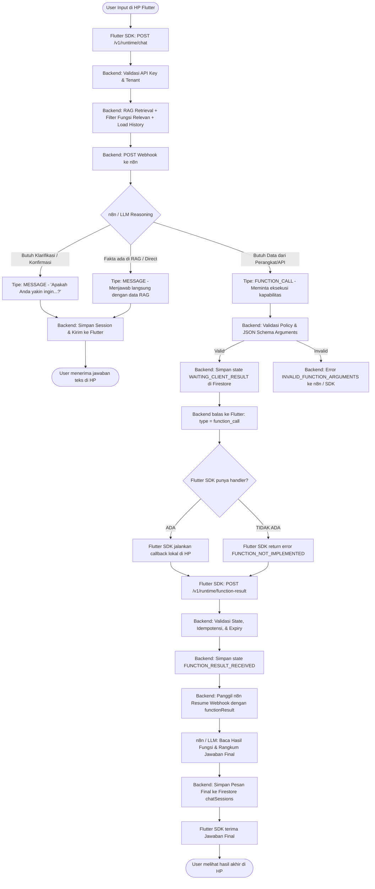
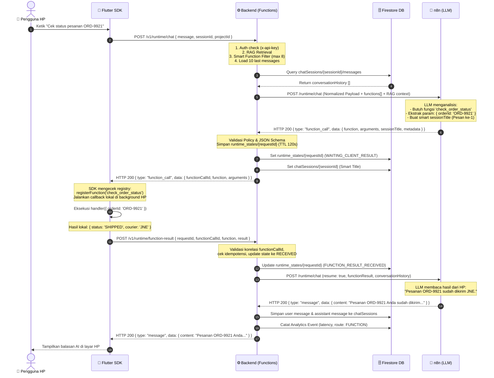

# INFRIA Tripartite Architecture & End-to-End Function Calling Spec
**Dokumentasi Teknis: Kolaborasi 3 Pihak (Flutter SDK ↔ Backend Cloud Functions ↔ n8n AI Orchestrator)**  
**Versi:** 1.0 (Production Architecture)  
**Target:** Tim Flutter SDK, Tim Backend, dan Tim n8n Workflow

---

## 1. Executive Summary & Pembagian Tanggung Jawab

Arsitektur sistem INFRIA menggunakan pola **Tripartite (3 Pihak)** yang memisahkan tanggung jawab secara tegas (*Separation of Concerns*) agar sistem aman, cepat, dan mudah di-maintain:

```
┌───────────────────────────────────────────────────────────────────────────────────────────┐
│                                   INFRIA ECOSYSTEM                                        │
└───────────────────────────────────────────────────────────────────────────────────────────┘

 📱 [ FLUTTER SDK (Client HP) ]
    ├── Kirim Chat: POST /v1/runtime/chat
    ├── Daftarkan handler lokal: infria.registerFunction(name, handler)
    ├── Eksekusi kode lokal di HP (akses SQLite, GPS, Token Auth, API internal)
    └── Kirim hasil eksekusi: POST /v1/runtime/function-result
         ▲                                                │
         │ (HTTP Response)                                │ (HTTP Request)
         ▼                                                ▼
 ⚙️ [ BACKEND INFRIA (Cloud Functions) ] ── (Database Firestore)
    ├── Gateway Keamanan: Validasi x-api-key, rate-limit, validasi kepemilikan project
    ├── RAG Search: Mengambil dokumen pengetahuan relevan dari vector database
    ├── Smart Capability Selector: Menyaring hanya fungsi yang relevan (Inject Limit)
    ├── Riwayat Percakapan: Membaca & menyimpan chatSessions/{sessionId}/messages
    ├── State Machine Tracker: Mencatat runtime_states/{requestId} (korelasi & idempotensi)
    └── Validasi JSON Schema: Memastikan argumen AI cocok sebelum dikirim ke HP
         ▲                                                │
         │ (HTTP Response)                                │ (HTTP Request Webhook)
         ▼                                                ▼
 🧠 [ n8n WORKFLOW (AI Reasoning Engine) ]
    ├── Murni STATELESS: Tidak boleh colok database Firestore & tidak boleh simpan memory lokal
    ├── Prompt Builder: Menggabungkan Persona + RAG Context + Riwayat Chat
    ├── Tool Binder: Mendaftarkan kapabilitas fungsi ke model LLM (OpenAI / Claude)
    ├── Decision Maker: Menentukan apakah cukup dijawab teks, tanya konfirmasi, atau panggil fungsi
    └── Grounding Evaluator & Smart Title: Menilai akurasi bukti & membuat judul sesi otomatis
```

---

## 2. Alur Kerja Lengkap (Flowchart & Sequence Diagram)

### 2.1. Master Flowchart (Decision Tree)



---

### 2.2. Sequence Diagram (End-to-End Function Calling & Resume)

Diagram di bawah ini menggambarkan komunikasi nyata per HTTP hop antara **Flutter SDK**, **Backend**, dan **n8n**:



---

## 3. Dinamika Session Title & Riwayat Chat (Menjawab Masalah Title)

### 3.1. Masalah yang Sering Terjadi
> *"Kemarin kan bikin chat sessions, terus dia ngasih title. Kalau BE ngirim chat ke-2, apakah title kena respon lagi dan kemungkinan berubah beda? Itu gimana?"*

### 3.2. Solusi & Logika Arsitektur:
1. **Pesan Pertama (Turn 1):**
   - Belum ada judul di database.
   - n8n meminta LLM men-generate `sessionTitle` singkat (3–5 kata) berdasarkan topik pembuka user.
   - Contoh: User bilang *"Halo, pesanan ORD-001 saya belum sampai ya?"* ➔ `sessionTitle: "Status Pesanan ORD-001"`.
   - Backend menyimpan `title` ini ke dokumen `chatSessions/{sessionId}` di Firestore.
2. **Pesan Kedua dan Seterusnya (Turn 2+):**
   - Dokumen `chatSessions/{sessionId}` **sudah punya title**.
   - n8n **tidak wajib** mengirim `sessionTitle` baru di setiap respon pesan lanjutan.
   - **Logika di Backend (`runtime.controller.js`):**
     ```javascript
     if (!sessionSnap.exists) {
       // Turn 1: Buat dokumen session baru dengan Smart Title dari AI
       await sessionRef.set({
         title: smartTitle || (message.slice(0, 60) + '…'),
         createdAt: nowIso,
         messageCount: 2
       });
     } else {
       // Turn 2+: JANGAN timpa title lama, KECUALI jika sessionTitle baru secara eksplisit dikirim 
       // dan berbeda kategori topik drastis. Jika tidak, pertahankan judul awal!
       await sessionRef.update({
         messageCount: admin.firestore.FieldValue.increment(2),
         updatedAt: nowIso
       });
     }
     ```
   - **Hasil:** Judul sesi di sidebar chat tetap stabil dan tidak berubah-ubah setiap kali user mengetik "Oke makasih", "Lalu bagaimana", dsb.

---

## 4. Spesifikasi Kapabilitas (Function Calling) yang Dikirim ke n8n

### 4.1. Kenapa Tidak Semua Fungsi Dikirim? (Token Efficiency)
Jika project memiliki 50 fungsi aktif, mengirim semuanya ke LLM akan:
- Memboroskan token context window (biaya mahal).
- Membuat LLM bingung (*hallucination / tool confusion*).
- Menambah latensi respon.

**Solusi Backend INFRIA (Smart Function Selector):**
- Menggunakan batas `FUNCTION_INJECT_LIMIT = 8` (dikonfigurasi di `env.js`).
- Jika total fungsi aktif ≤ 8: Semua fungsi dikirim ke n8n.
- Jika total fungsi aktif > 8: Backend melakukan skoring relevansi token kata kunci antara teks pertanyaan user dengan `name` + `description` fungsi. Hanya **Top 8 paling relevan** yang disuntikkan ke n8n.

### 4.2. Format JSON Schema Kapabilitas ke n8n
Berikut adalah bentuk array `functions[]` yang dikirim BE ke n8n:

```json
[
  {
    "id": "fn_check_order_status",
    "name": "check_order_status",
    "description": "Mengecek status pelacakan pesanan, resi, dan estimasi kurir",
    "parameters": {
      "type": "object",
      "properties": {
        "orderId": {
          "type": "string",
          "description": "Nomor identifikasi pesanan pelanggan, cth: ORD-9921"
        }
      },
      "required": ["orderId"]
    }
  }
]
```

Di dalam n8n, array ini di-pass langsung ke node **AI Agent / OpenAI Model Tool Definitions**.

---

## 5. Kontrak Teknis Payload (Data Contracts)

### 5.1. Pihak 1: n8n Workflow (AI Orchestrator)

#### A. Input yang Diterima n8n dari Backend:
Webhook n8n menerima payload terstandardisasi (*Normalized Orchestration Payload*):

##### 1. Mode Fresh Chat (`resume: false` atau tidak ada field resume):
```json
{
  "project": { "id": "demo-store-7f42" },
  "session": { "id": "sim_881920" },
  "user": { "id": "usr_owner_123" },
  "ai": {
    "assistantName": "INFRIA Assistant",
    "role": "Customer Service",
    "language": "id",
    "tone": "friendly",
    "model": "gpt-4o-mini"
  },
  "knowledge": {
    "enabled": true,
    "context": [
      "Kebijakan Toko: Pengembalian barang maksimal 3 hari setelah paket diterima."
    ]
  },
  "functions": [
    {
      "name": "check_order_status",
      "description": "Mengecek status pesanan pelanggan",
      "parameters": {
        "type": "object",
        "properties": { "orderId": { "type": "string" } },
        "required": ["orderId"]
      }
    }
  ],
  "message": "Cek pesanan ORD-001 saya dong",
  "conversationHistory": [
    { "role": "user", "content": "Halo selamat pagi" },
    { "role": "assistant", "content": "Halo! Ada yang bisa saya bantu?" }
  ]
}
```

##### 2. Mode Resume Callback (`resume: true`):
```json
{
  "resume": true,
  "requestId": "req_178920_abc",
  "project": { "id": "demo-store-7f42" },
  "session": { "id": "sim_881920" },
  "user": { "id": "usr_owner_123" },
  "ai": { ... },
  "functions": [ ... ],
  "functionResult": {
    "name": "check_order_status",
    "arguments": { "orderId": "ORD-001" },
    "result": {
      "status": "SHIPPED",
      "courier": "JNE Express",
      "trackingNumber": "JNE991823019",
      "estimatedDelivery": "Besok Sore"
    }
  },
  "conversationHistory": [ ...10 pesan terakhir... ]
}
```

---

#### B. Output yang Wajib Dikembalikan n8n ke Backend:
n8n harus menggunakan node **Respond to Webhook** dengan status `200 OK` mengembalikan salah satu format berikut:

##### Opsi 1: Menjawab Teks (Langsung / RAG / Minta Konfirmasi)
```json
{
  "type": "message",
  "data": {
    "content": "Pesanan ORD-001 Anda saat ini sudah dikirim via JNE dengan estimasi tiba besok sore.",
    "sessionTitle": "Status Pesanan ORD-001",
    "metadata": {
      "evidenceLevel": "HIGH",
      "evidenceReason": "Data live diterima langsung dari kurir pengiriman.",
      "isKnowledgeGap": false,
      "topicCategory": "Order & Shipping"
    }
  }
}
```

##### Opsi 2: AI Meminta Eksekusi Client Capability (Function Call)
```json
{
  "type": "function_call",
  "data": {
    "function": "check_order_status",
    "arguments": {
      "orderId": "ORD-001"
    },
    "sessionTitle": "Pengecekan Pesanan",
    "metadata": {
      "evidenceLevel": "HIGH",
      "evidenceReason": "AI memerlukan live status pesanan dari sistem toko.",
      "isKnowledgeGap": false,
      "topicCategory": "Order & Shipping"
    }
  }
}
```

---

### 5.2. Pihak 2: Backend INFRIA (Cloud Functions)

Backend bertindak sebagai **Validator & State Machine**:
1. **Saat n8n mengembalikan `function_call`:**
   - Backend memvalidasi `function` ada di daftar fungsi aktif (Policy Enforcement).
   - Backend memvalidasi tipe argumen terhadap JSON Schema (menolak jika salah tipe, misal number padahal string).
   - Backend menyimpan dokumen state tracking:
     `users/{workspaceId}/projects/{projectId}/runtime_states/{requestId}`
     ```json
     {
       "requestId": "req_178920_abc",
       "projectId": "demo-store-7f42",
       "sessionId": "sim_881920",
       "status": "WAITING_CLIENT_RESULT",
       "functionCallId": "fc_9921_xyz",
       "functionName": "check_order_status",
       "createdAt": 1789200000000,
       "expiresAt": 1789200120000
     }
     ```
   - Backend mem-forward payload bersih ke Flutter SDK / Web Console Simulator:
     ```json
     {
       "requestId": "req_178920_abc",
       "type": "function_call",
       "data": {
         "functionCallId": "fc_9921_xyz",
         "function": "check_order_status",
         "arguments": { "orderId": "ORD-001" }
       }
     }
     ```

2. **Saat Client mengirim callback `POST /v1/runtime/function-result`:**
   - Backend memverifikasi:
     - Apakah `requestId` ditemukan di Firestore? (Jika tidak ➔ `INVALID_REQUEST`).
     - Apakah status sudah `FUNCTION_RESULT_RECEIVED`? (Idempotensi ➔ kembalikan `{ duplicate: true }`).
     - Apakah waktu sudah melebihi `expiresAt` (120 detik)? (Jika ya ➔ `FUNCTION_CALL_EXPIRED`).
     - Apakah `functionCallId` dan `function.name` cocok dengan state? (Jika tidak ➔ `FUNCTION_RESULT_MISMATCH`).
   - Jika lolos validasi, backend mentransisikan status menjadi `FUNCTION_RESULT_RECEIVED`.
   - Backend memanggil `resumeOrchestration()` ke n8n dengan data `functionResult`.

---

### 5.3. Pihak 3: Flutter SDK (Client Device)

#### A. Inisialisasi & Registrasi Fungsi Lokal di Flutter
Pengembang aplikasi cukup mendefinisikan nama kapabilitas dan fungsi Dart yang akan dipanggil:

```dart
// 1. Inisialisasi SDK
await Infria.initializeApp(
  projectId: 'demo-store-7f42',
  apiKey: 'infria_pk_live_xxxx',
  appName: 'Toko Kita App',
  platform: InfriaPlatform.flutter,
);

// 2. Registrasi kapabilitas lokal di HP
InfriaChat.instance.registerFunction(
  name: 'check_order_status',
  handler: (Map<String, dynamic> args) async {
    final orderId = args['orderId'] as String;
    
    // Panggil database lokal, sensor HP, atau API internal
    final orderData = await MyOrderRepository.getOrder(orderId);
    
    // Return Map<String, dynamic> yang akan otomatis dikirim balik ke INFRIA
    return {
      'orderId': orderId,
      'status': orderData.status,
      'courier': orderData.courierName,
      'trackingNumber': orderData.airwayBill,
      'estimatedDelivery': 'Besok Sore',
    };
  },
);
```

#### B. Apa yang Dilakukan Flutter SDK di Balik Layar Saat User Chat?
1. Saat user memanggil `await InfriaChat.instance.sendMessage(message: "Cek pesanan ORD-001")`:
   SDK mengirim HTTP POST ke `https://api.infria.io/v1/runtime/chat`.
2. Jika respons dari backend bertipe `message`:
   SDK langsung mengembalikan isi teks ke widget UI chat.
3. Jika respons dari backend bertipe `function_call`:
   - SDK **tidak menampilkan pesan error ke user**.
   - SDK mencari handler di registry internal: `_handlers['check_order_status']`.
   - SDK mengeksekusi handler lokal dengan argumen `{ orderId: 'ORD-001' }`.
   - Setelah selesai mendapatkan hasil return `Map`, SDK otomatis mengirim HTTP POST ke:
     `https://api.infria.io/v1/runtime/function-result`:
     ```json
     {
       "requestId": "req_178920_abc",
       "functionCallId": "fc_9921_xyz",
       "function": {
         "name": "check_order_status",
         "arguments": { "orderId": "ORD-001" }
       },
       "result": {
         "status": "SHIPPED",
         "courier": "JNE Express",
         "trackingNumber": "JNE991823019",
         "estimatedDelivery": "Besok Sore"
       }
     }
     ```
   - SDK menerima respons balasan final dari AI dan menampilkannya di layar HP!

#### C. Bagaimana Jika Fungsi Belum Di-register di Flutter?
Jika AI meminta fungsi yang belum diimplementasikan oleh developer Flutter di HP:
- SDK menangkap kondisi ini dan mengirim callback error ke backend:
  ```json
  {
    "requestId": "req_178920_abc",
    "functionCallId": "fc_9921_xyz",
    "function": { "name": "unknown_function" },
    "result": {
      "error": "FUNCTION_NOT_IMPLEMENTED_ON_CLIENT",
      "message": "Client device does not support or has not registered capability 'unknown_function'."
    }
  }
  ```
- AI di n8n menerima info bahwa fungsi tersebut tidak tersedia di HP user, lalu AI menjawab secara sopan:
  *"Fitur tersebut saat ini belum didukung di versi aplikasi Anda."*

---

## 6. Skenario Khusus: Konfirmasi Sebelum Eksekusi (Sensitive Actions)

Ada kalanya kapabilitas bernilai sensitif (misal: *transfer uang, batalkan pesanan, hapus akun*). Dalam kasus ini, alurnya adalah:

1. **User Chat di HP:** *"Tolong batalkan pesanan ORD-001 saya."*
2. **AI di n8n Memilih Bertanya Dulu (Tipe `message`):**
   - AI **belum** memanggil `function_call`.
   - AI membalas: *"Apakah Anda yakin ingin membatalkan pesanan ORD-001? Tindakan ini tidak dapat dibatalkan."*
3. **User Chat di HP:** *"Ya, saya yakin batalkan."*
4. **AI di n8n Baru Memanggil Function Call:**
   - Memanggil `cancel_order` dengan `{ orderId: "ORD-001" }`.
5. **Flutter SDK Eksekusi Lokal & Resume AI Memberi Laporan Sukses.**

---

## 7. Ringkasan Tugas & Action Item untuk Masing-Masing Tim

| Tim | Apa yang Harus Dilakukan | Checklist Status |
| :--- | :--- | :--- |
| **Tim Backend (Cloud Functions)** | <ul><li>Sudah implementasi validasi JSON Schema & Policy Enforcement</li><li>Sudah implementasi Smart Function Selector (max 8)</li><li>Sudah implementasi `runtime_states` dengan TTL 120s & Idempotency</li><li>Sudah menyediakan endpoint `/v1/runtime/chat`, `/v1/runtime/function-result`, dan `/v1/functions/test`</li><li>Sudah otomatis menyimpan sesi & riwayat chat di Firestore</li></ul> | ✅ **SELESAI (Tested with 24 Jest tests)** |
| **Tim n8n Workflow** | <ul><li>Buat Webhook node `POST /runtime/chat` dengan mode `Respond to Webhook`</li><li>Inject System Message (`ai.*` + `knowledge.context`)</li><li>Bind array `functions` ke Tool Definition LLM</li><li>Inject `conversationHistory` ke LLM</li><li>Kembalikan format standar `{ type: "message", data: { content, sessionTitle, metadata } }` atau `{ type: "function_call", data: { function, arguments, sessionTitle, metadata } }`</li><li>Jangan pasang node Firestore & jangan pasang Simple Memory di n8n</li></ul> | 🔄 **Siap Dikonfigurasi di Workflow n8n** |
| **Tim Flutter SDK** | <ul><li>Implementasikan method `InfriaChat.instance.registerFunction(name, handler)`</li><li>Saat menerima respons `type == "function_call"`, panggil handler lokal</li><li>Setelah handler return, otomatis kirim HTTP POST ke `/v1/runtime/function-result`</li><li>Tampilkan jawaban teks final ke layar aplikasi chat</li></ul> | 🔄 **Siap Diintegrasikan di SDK** |
